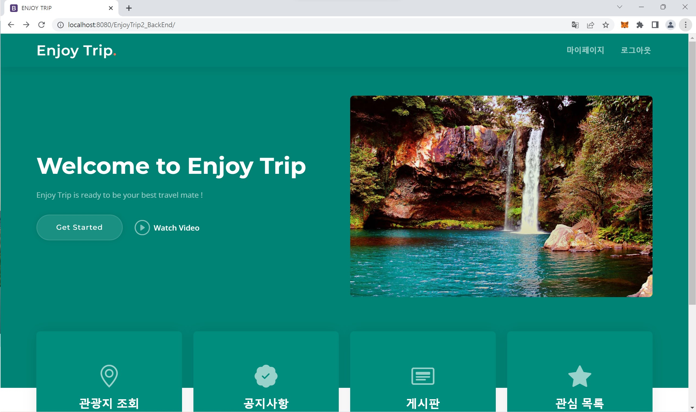
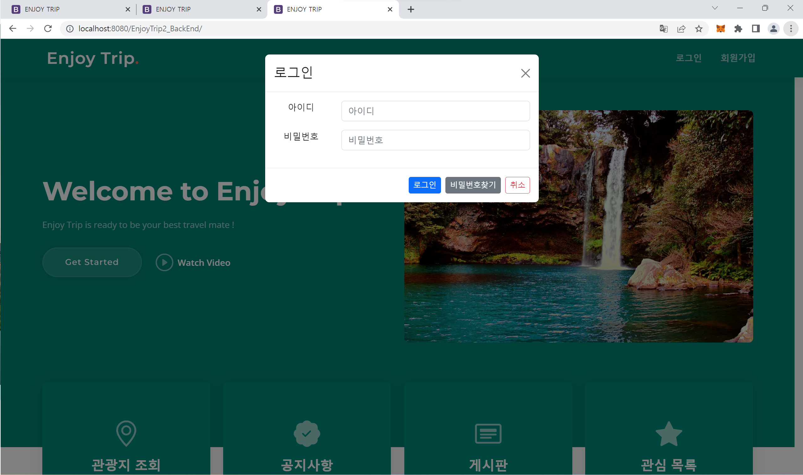
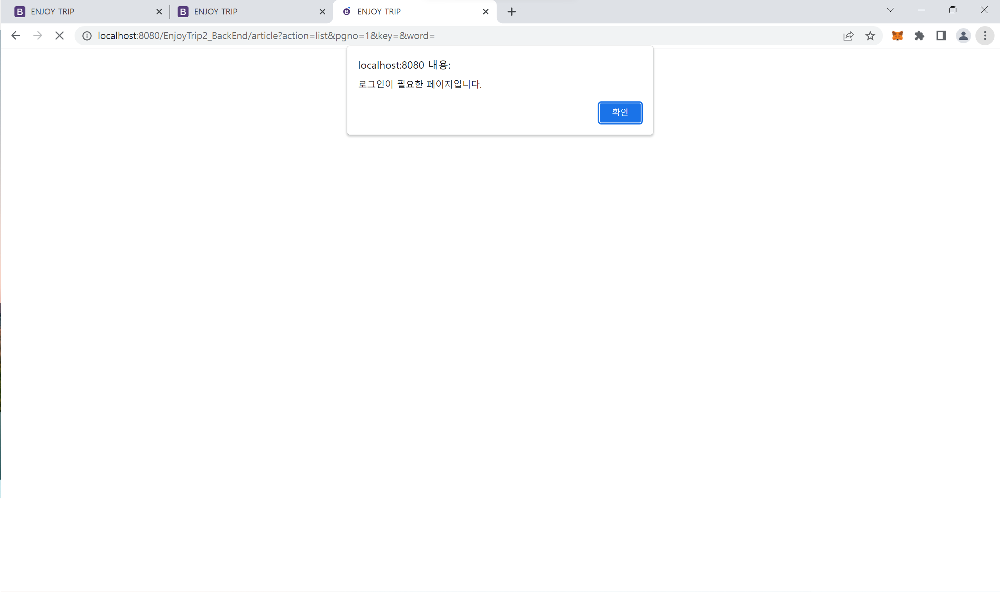
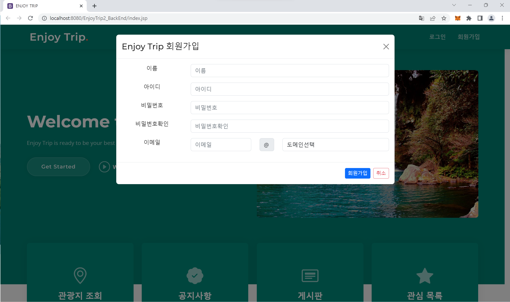
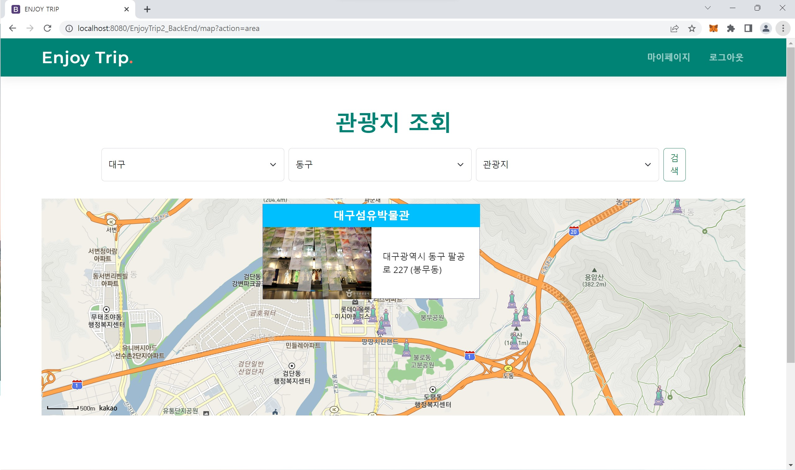
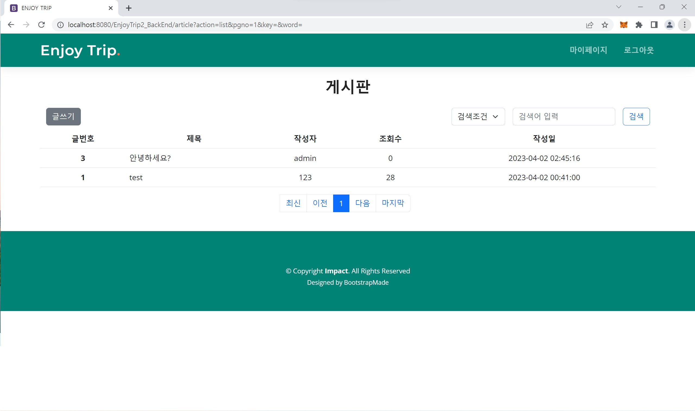
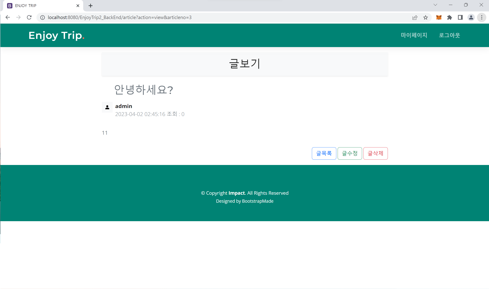
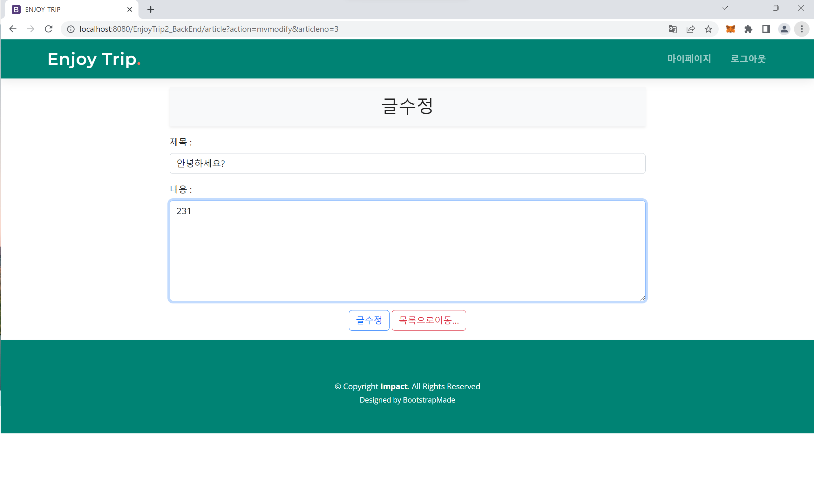
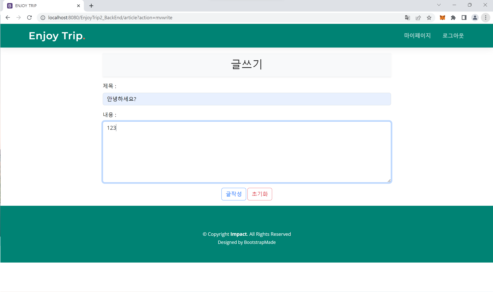

# EnjoyTrip_Java_조경호_최희주

## 1. 화면 구성 결과

#### 메인 페이지
- 로그인 전 화면

- 로그인 후 화면

## 로그인, 회원가입
- 로그인 모달

- 로그인 필요 알람

- 회원가입 모달

#### 조회 페이지
- 관광지 조회 화면

#### 게시판 페이지
- default 화면

- 포스트 확인 화면

- 포스트 수정 화면

- 포스트 쓰기 화면

